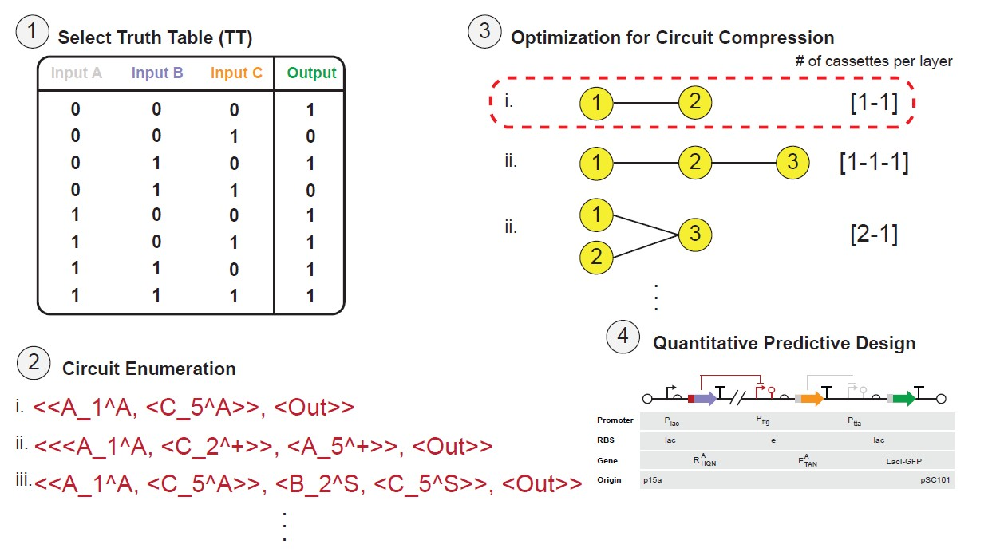

## Algorithmic Enumeration of 3-input Transcriptional Programming Circuits

  

This repository contains codes for algorithmic enumeration of 3-input transcriptional programming (T-Pro) circuits in our paper ["Engineering wetware and software for the predictive design of compressed genetic circuits for higher-state decision-making"]().

    Engineering wetware and software for the predictive design of compressed genetic circuits for higher-state decision-making
        Brian D. Huang, Yongjoon Yu, Junghwan Lee, Matthew W. Repasky, Yao Xie, Matthew J. Realff, and Corey J. Wilson
        Under review

### Installation
The codes were written in Python 3.9.13. If you want to implement on your local machine,

1. Clone this repository

        git clone https://github.com/Jayaos/Tpro
2. Move to the directory where you clone this repository and install requirements using pip

        pip install -r requirements.txt

### Algorithmic Enumeration Example 
We provide a Colab notebook example with step-by-step instructions for implementing algorithmic enumeration of 3-input Tpro circuits.

### Single-input Single-output (SISO) Performance Optimization
We provide a Colab notebook with interactive tools for Hill function fitting and RBS optimization of single-input transcriptional modules, which can also be extended to multi-input (MISO) circuit performance prediction.

